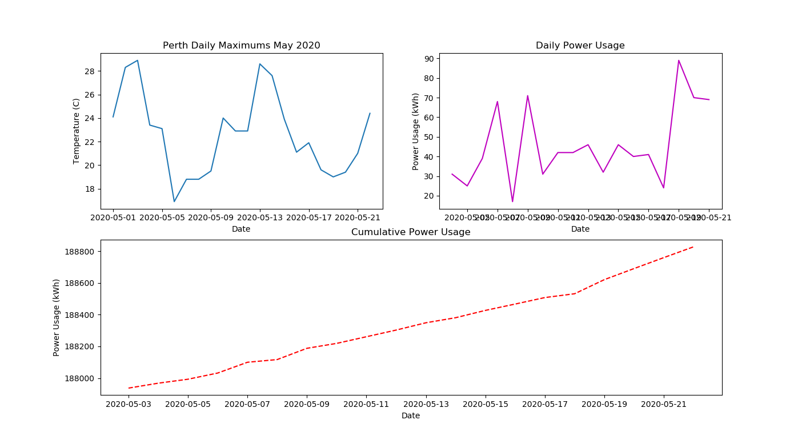
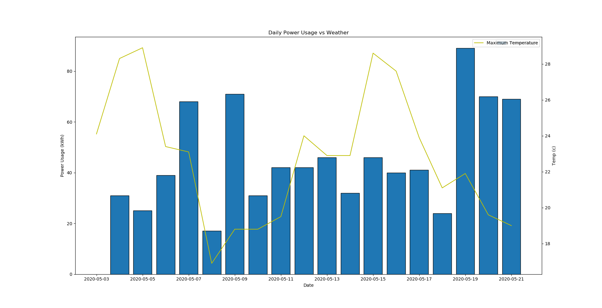

# Investigation 1 Report - Power Usage

# Abstract
 The recording of power usage allows for the analysis of power usage trends and other underlying data that contributes to power usage. This paper explores the results of recording a power meter at a residence, by measuring the data approximately every 24 hours and documenting the results. Using python 3.7 and modules related to the anacoda distribution, a shallow analysis of power usage can be made. Python allows the power usage trends to be compared against other data sets, such as weather. Using the pandas module statistical data can be inferred.

# Background
Energy usage or power usage in homes are typically recorded on a power meter located on the premise. They are used to measure how much energy is consumed on the property. Power usage is stored in kilowatt-hours (kWh). Generally the trends of power usage can be correlated to internal or external factors upon the residents of the household. One relationship that will be explored is the relation between energy usage and maximum temperature for the day. This report makes uses of the pandas software library for python. The pandas package simply allows for data to be analysed and manipulated, in particular using a dataframe. A dataframe is tabular data structure that consists of rows and columns.

# Methodology
Each day at approximately 9:00pm the reading of the power meter will be documented in a CSV (Comma Separated Values) file, along side the current date. The recordings were taken for 20 days beginning on the 3rd of May. Once the data is recorded, the daily maximum temperatures for May 2020, Perth, Western Australia are downloaded from the Bereau of Meteorology (BoM) and stored in an adjacent CSV file. Using the pandas package the CSV files are parsed in and stored in a pandas data frame. The data is then further pulled apart and stored in labeled lists, including creating lists of date objects. As the readings from the power meter record cumulative power usage and not the day to day power usage, a new dataframe was created using the `.diff()` method which stores the difference of the current element subtract the previous (n - (n-1)). Two .py files are used to simulate the data, **uasge.py** and **usagecomparison.py**. Both files read the same data but output the results in a different matter, usage.py showing 3 seperate plots, whereas usagecomparison.py overlays the data sets of daily powerusage and daily maximums.

Example if the .diff() method
`difference_df = power_df['usage'].diff()`
```
POWER USAGE
0     187937
1     187968
2     187993
3     188032
4     188100
5     188117
6     188188
7     188219
8     188261
9     188303
10    188349
11    188381
12    188427
13    188467
14    188508
15    188532
16    188621
17    188691
18    188760
19    188828

.. to become

0      NaN
1     31.0
2     25.0
3     39.0
4     68.0
5     17.0
6     71.0
7     31.0
8     42.0
9     42.0
10    46.0
11    32.0
12    46.0
13    40.0
14    41.0
15    24.0
16    89.0
17    70.0
18    69.0
19    68.0

notice it is one element shorter.
```

# Results
## usage.py

*Figure 1*
Three data sets are plotted

1. Weather
2. Daily Power Usage
3. Cumulative Power Usage

The results of the program graphically present the findings in a visual format. Findings show that when daily power usage jumps, the slope of the cumulative graph increases and vice versa. Further analysis is needed.

## usagecomparison.py

*Figure 2*
Daily power usage and weather are overlayed on the same x axis, whilst having different y axes. It can be observed that the shape of both graphs may show similar shapes of power usage and the maximum temperature of each day.


## Pandas Statistics
DAILY POWER USAGE
count    19.000000
mean     46.894737
std      19.840740
min      17.000000
25%      31.500000
50%      42.000000
75%      68.000000
max      89.000000
*stats.txt*
From results the baseline or average usage per day was 48.894737 kWH. The maxmimum was 89 kWh and minimum was 17 kWh

# Conclusion and Future Work
In conclusion, results show that there lies a correlation between the external factor of weather and change in energy consumption. When the daily maxmimum temperature drops, energy consumption also drops similarly. This may be due to colder days where the use of certain appliances is halted, such as the use of airconditioning. Rain may have also occured on that day and the use of washing machines or dryers is halted. It may also explain that the days following, more energy is used as laundry loads are resumed. The circumstances could be by chance as the sample size is low (n=20), where n is the number of days measured. In further investigations a greater sample size could be used and the data could be recorded in another season/location.

# References
https://www.energyaustralia.com.au/home/bills-and-accounts/understanding-your-meter
http://www.bom.gov.au/climate/dwo/202005/html/IDCJDW6111.202005.shtml
https://pandas.pydata.org/pandas-docs/stable/reference/api/pandas.DataFrame.diff.html
https://pandas.pydata.org/
