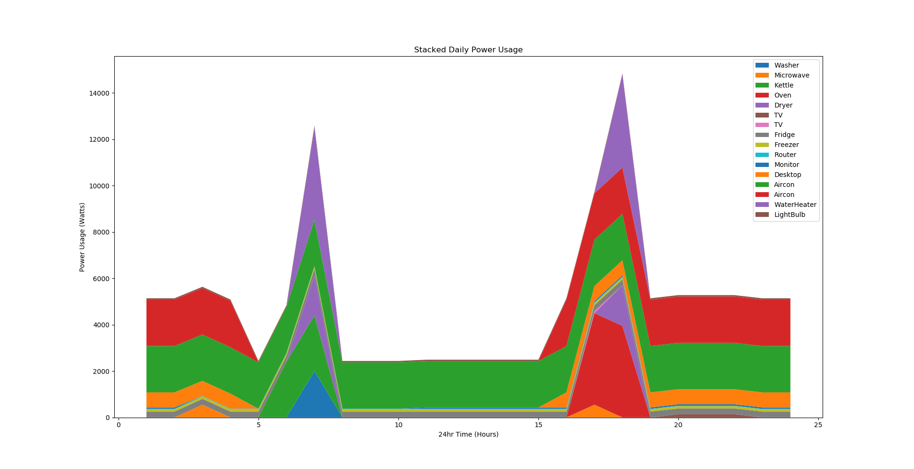
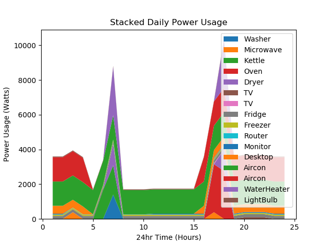

# Investigation 2 Report - Power Modelling
# Abstract
The quantity and efficiency of appliances in the home can effect the overall energy usage of a residence. This paper explores the usage of appliances in a home based off an appliance model and aims to compare to results from Investigation 1 - power usage. Using jupyter notebooks and matplotlib the daily usage of appliances can be visualized in a more granular format, estimating what hours appliances are used and for which hours in the day they are on. Combined with gathering appliances energy usage, a more indepth snapshot of daily power usage can be taken. A comparison to total energy consumption will also be made if solar energy was installed

# Background
Appliances generally document the wattage the appliances uses per hour. The equation to calculate daily power usage in kWh is (wattage) * (hours used per day) / 1000. By creating a list of appliances around the house, alongside the wattage and a series of 24 values representing the state of appliance, an appliance model CSV file can be created. From this file the values can be plotted.

# Methodology
A list of appliances is gathered, with wattage obtained via reading the back of the device or looking up a similar model online. Then an estimate of what hours of the day the device is powered on; or if not a full hour, what percentage of an hour the appliance is on.
The CSV file follows the structure. Three colon separated values, with the last value being a string of 24 numbers delimited by a comma. The first colon separated elemt is appended to a list of appliance names. The second colon seperated value is wattage, which is casted to a float and stored in the wattages list. Lastly the third and final element comprises of a multiple comma separated values. Each value is split on each comma, multiplied by the wattage and converted to a float. The value is then stored in the usage list. When simulating a home with a solar power system, the total wattage of each appliance will be multiplied by a factor of 0.7, meaning that 30% of power usage is absorbed/ powered by solar.

The collected csv file follows.
```
Washer:2000:0,0,0,0,0,0,1,0,0,0,0,0,0,0,0,0,0,0,0,0,0,0,0,0
Microwave:1100:0,0,0.5,0,0,0,0,0,0,0,0,0,0,0,0,0,0.5,0,0,0,0,0,0,0
Kettle:2400:0,0,0,0,0,1,1,0,0,0,0,0,0,0,0,0,0,0,0,0,0,0,0,0
Oven:3950:0,0,0,0,0,0,0,0,0,0,0,0,0,0,0,0,1,1,0,0,0,0,0,0
Dryer:1750:0,0,0,0,0,0,1,0,0,0,0,0,0,0,0,0,0,1,0,0,0,0,0,0
TV:137:0,0,0,0,0,0,0,0,0,0,0,0,0,0,0,0,0,0,0,1,1,1,0,0
TV:88:0,0,0,0,0,0,0,0,0,0,0,0,0,0,0,0,1,0,0,0,0,0,0,0
Fridge:250:1,1,1,1,1,1,1,1,1,1,1,1,1,1,1,1,1,1,1,1,1,1,1,1
Freezer:100:1,1,1,1,1,1,1,1,1,1,1,1,1,1,1,1,1,1,1,1,1,1,1,1
Router:20:1,1,1,1,1,1,1,1,1,1,1,1,1,1,1,1,1,1,1,1,1,1,1,1
Monitor:60:1,1,0.1,0.1,0.1,0.1,0.1,0.1,0.1,0.1,1,1,1,1,1,1,1,1,1,1,1,1,1,1
Desktop:650:1,1,1,1,0,0,0,0,0,0,0,0,0,0,0,1,1,1,1,1,1,1,1,1
Aircon:2000:1,1,1,1,1,1,1,1,1,1,1,1,1,1,1,1,1,1,1,1,1,1,1,1
Aircon:2000:1,1,1,1,0,0,0,0,0,0,0,0,0,0,0,1,1,1,1,1,1,1,1,1
WaterHeater:4000:0,0,0,0,0,0,1,0,0,0,0,0,0,0,0,0,0,1,0,0,0,0,0,0
LightBulb:60:1,1,1,1,1,1,1,1,1,1,1,1,1,1,1,1,1,1,1,1,1,1,1,1

```
Multiplying each element of the usage list by the wattage
```

INPUT: ['Oven', '3950', '0,0,0,0,0,0,0,0,0,0,0,0,0,0,0,0,1,1,0,0,0,0,0,0']

# list comprehension splitting the long string of numbers into floats and 
                                          multiplying by current wattage

    usagelist = [float(i) * appliancewattage for i in p_usage.split(',')]

OUTPUT: [0.0, 0.0, 0.0, 0.0, 0.0, 0.0, 0.0, 0.0, 0.0, 0.0, 0.0, 0.0, 0.0, 
         0.0, 0.0, 0.0, 3950.0, 3950.0, 0.0, 0.0, 0.0, 0.0, 0.0, 0.0]
```

Simulating solar power
```
appliancewattage = (0.7 * (float(row[1]))) # simulating solar
                        power provides 30% of power
```

# Results

*Figure 1 - normal energy consumption*
** Total power usage (kWh/24hrs) = 121.577) ** According to Investigation 1 the baseline power usage per day was approximately 46.8 kWh per day. Where as the simulated values is 3 time that value.

*Figure 2 - with solar power energy consumption*
Assuming solar energy provides 30 % of the total power ** Total power usage (kWh/24hrs) = 85.103) **


# Conclusion and Future Work
In conclusion the power model shows that energy usage tends to peak twice a day, early in the morning arond 8:00am and 6:00pm. This is due to the simulated values when the residents wake up/arrive home for work. The simulated results are too high when compared to the results of the first investigation. This may be due to the values of usage being to aggressive or the wattage values being inaccurate. Also note that the general shape of the graph did not change when solar power was simulated, as usage occurs at the same time throughout the day.

# References
https://python-graph-gallery.com/251-stacked-area-chart-with-seaborn-style/

